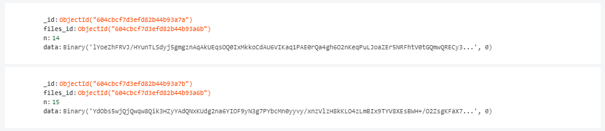

# Streamy-server<!-- omit in toc -->
>Modern audiobook streaming platform powered by _MongoDB_, _ElectronJS_, _NodeJS_ and _firebase serverless cloud-functions_

## Table of contents <!-- omit in toc -->
- [Overview](#overview)
- [Description](#description)
- [Backend](#backend)
  - [Routes](#routes)
  - [REST API](#rest-api)
  - [Database infrastructure](#database-infrastructure)
  - [Audiotracks Storing](#audiotracks-storing)
  - [Audiotrack Streaming](#audiotrack-streaming)
  - [Audiotrack Uploading](#audiotrack-uploading)
  - [Book Cover Image Storing](#book-cover-image-storing)
- [Postman Testing](#postman-testing)
  - [`GET`  `/audiobooks`](#get--audiobooks)
  - [`POST` `/audiobooks`](#post-audiobooks)
  - [`PUT` `/audiobooks/:audiobookID`](#put-audiobooksaudiobookid)
  - [`GET` `/audiobooks/:audiobookID`](#get-audiobooksaudiobookid)
  - [`DELETE` `/audiobooks/:audiobookID`](#delete-audiobooksaudiobookid)
  - [`POST` `/audiobooks/:audiobookID/chapters`](#post-audiobooksaudiobookidchapters)
  - [`PUT` `/audiobooks/:audiobookID/chapters/:chapterID`](#put-audiobooksaudiobookidchapterschapterid)
  - [`GET` `/audiobooks/:audiobookID/chapters`](#get-audiobooksaudiobookidchapters)
  - [`POST` `/audiotracks`](#post-audiotracks)
  - [`GET` `/audiotrack/:audiotrackID`](#get-audiotrackaudiotrackid)

## Overview

_Streamy_ is a not just a modern _Single Page Application (SPA)_ powered by [_ReactJS_](https://reactjs.org/) and packaged and distributed with [_ElectronJS_](https://www.electronjs.org/), but is a __full-stack free audiobook streaming platform__. 

## Description

The following repository is part of the [Streamy project](https://github.com/espressoshock/streamy-app) and holds the NodeJS _REST API_ as well as the firebase cloud functions. 
## Backend

The backend is written in _NodeJS_ and _ExpressJS_ and provides as a services access to the audiobook resources stored on a _MongoDB deployment._ 

> If you wanna learn more about the _**NoSQL MongoDB deployment**_ and the server implementation, please refer to its github page:  [streamy-server](https://github.com/espressoshock/streamy-server) 

### Routes

The NodeJS server utilizes the following _routes_: 

1. `audiobooksRoute`
2. `audiotrackRoute`
3. `usersRoute`

### REST API

The platform provides a _REST Open API_ through its _NodeJS_ server with the following __endpoints__:

1. `GET`  `/audiobooks`
2. `POST` `/audiobooks`
3. `PUT` `/audiobooks/:audiobookID`
4. `GET` `/audiobooks/:audiobookID`
5. `DELETE` `/audiobooks/:audiobookID`
6. `POST` `/audiobooks/:audiobookID/chapters`
7. `PUT` `/audiobooks/:audiobookID/chapters/:chapterID`
8. `GET` `/audiobooks/:audiobookID/chapters`
9. `POST` `/audiotracks`
10. `GET` `/audiotrack/:audiotrackID`

### Database infrastructure

The _Streamy_ platform utilizes two database solutions in order to operate correctly.

1. The _user data and authentication_ is stored and preocessed through the firebase infrastructure
2. The resources containing _big data_ such as books metadata as well as chapters and associated audiotracks are optimally stored in a MongoDB deployment with [GridFS](https://mongodb.github.io/node-mongodb-native/3.4/tutorials/gridfs/)

### Audiotracks Storing 

Due to the large size of the audiotracks, such documents are stored in a NoSQL MongoDB database as chuncks with the use of [GridFS](https://mongodb.github.io/node-mongodb-native/3.4/tutorials/gridfs/). Rather than storing the audiotracks in a single file, GridFS subdivides the document into multiple chunks of `255kB`, allowing more efficient storing but also _in order to facilitate the audio streaming operation_

The chunks are stored alongside the file metadata

### Audiotrack Streaming

The `GET /audiotracks/:audiotrackID` endpoint serves the audiotracks as `audio/mp3` and the tracks are streamed in `chuncks` as they are retrived from the _MongoDB GridFS_ `bucket`

### Audiotrack Uploading

The `POST /audiotracks` endpoint uploads the audiotracks in the GridFS bucket `audiotracks`. The endoints supports two fiels:

   1. `name`: filename to attach the the file metadata
   2. `file`: actual file to upload

### Book Cover Image Storing

All the books' covers are stored in `base64` rather than `binary` in order to facilitate the deserialization and _allow direct html-injection_.

## Postman Testing

###  `GET`  `/audiobooks`

### `POST` `/audiobooks`

### `PUT` `/audiobooks/:audiobookID`

### `GET` `/audiobooks/:audiobookID`

### `DELETE` `/audiobooks/:audiobookID`

### `POST` `/audiobooks/:audiobookID/chapters`

### `PUT` `/audiobooks/:audiobookID/chapters/:chapterID`

### `GET` `/audiobooks/:audiobookID/chapters`

###  `POST` `/audiotracks`

### `GET` `/audiotrack/:audiotrackID`

